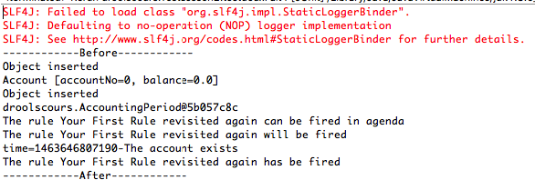
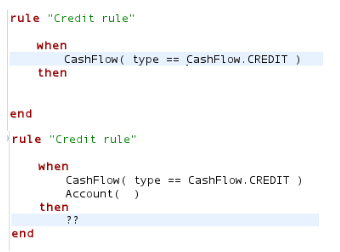
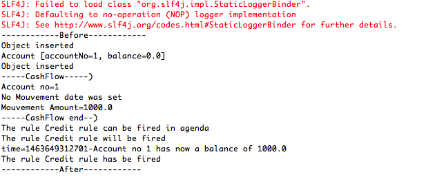
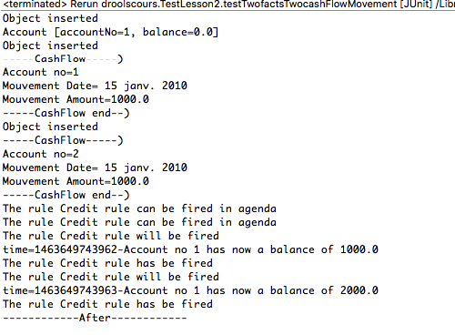
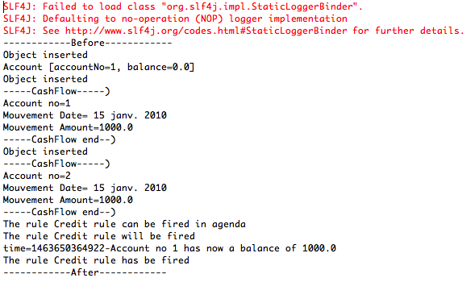
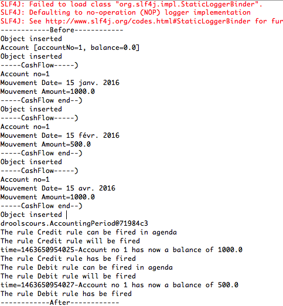

# Lesson 2 : binding

## Adding callback initialization and more

To be able to see what is happening in the rule engine, we shall add to the KnowledgeSessionHelper this method

```text
  public static KieSession getStatefulKnowledgeSessionWithCallback(
            KieContainer kieContainer, String sessionName) {
        KieSession session = getStatefulKnowledgeSession(kieContainer, sessionName);
        session.addEventListener(new RuleRuntimeEventListener() {
            public void objectInserted(ObjectInsertedEvent event) {
                System.out.println("Object inserted \n"
                        + event.getObject().toString());
            }
            public void objectUpdated(ObjectUpdatedEvent event) {
                System.out.println("Object was updated \n"
                        + "new Content \n" + event.getObject().toString());
            }
            public void objectDeleted(ObjectDeletedEvent event) {
                System.out.println("Object retracted \n"
                        + event.getOldObject().toString());
            }
        });
        session.addEventListener(new AgendaEventListener() {
            public void matchCreated(MatchCreatedEvent event) {
                System.out.println("The rule "
                        + event.getMatch().getRule().getName()
                        + " can be fired in agenda");
            }
            public void matchCancelled(MatchCancelledEvent event) {
                System.out.println("The rule "
                        + event.getMatch().getRule().getName()
                        + " cannot b in agenda");
            }
            public void beforeMatchFired(BeforeMatchFiredEvent event) {
                System.out.println("The rule "
                        + event.getMatch().getRule().getName()
                        + " will be fired");
            }
            public void afterMatchFired(AfterMatchFiredEvent event) {
                System.out.println("The rule "
                        + event.getMatch().getRule().getName()
                        + " has be fired");
            }
            public void agendaGroupPopped(AgendaGroupPoppedEvent event) {
            }
            public void agendaGroupPushed(AgendaGroupPushedEvent event) {
            }
            public void beforeRuleFlowGroupActivated(RuleFlowGroupActivatedEvent event) {
            }
            public void afterRuleFlowGroupActivated(RuleFlowGroupActivatedEvent event) {
            }
            public void beforeRuleFlowGroupDeactivated(RuleFlowGroupDeactivatedEvent event) {
            }
            public void afterRuleFlowGroupDeactivated(RuleFlowGroupDeactivatedEvent event) {
            }
        });
```

In the CashFlow class, we should add the following toString method

```text
import java.text.DateFormat;

public class CashFlow {
    public static int CREDIT = 1;
    public static int DEBIT = 2;

    @Override
    public String toString() {
        // TODO Auto-generated method stub
        StringBuffer buff = new StringBuffer();
        buff.append("-----CashFlow-----)\n");
        buff.append("Account no=" + this.accountNo + "\n");
        if (this.mvtDate != null) {
            buff.append("Mouvement Date= "
                    + DateFormat.getDateInstance().format(this.mvtDate)
                    + "\n");
        } else {
            buff.append("No Mouvement date was set\n");
        }
        buff.append("Mouvement Amount=" + this.amount + "\n");
        buff.append("-----CashFlow end--)");
        return buff.toString();
    }
```

in the util package, we shall create a DateHelper class that will look like this :

```text
package util;

import java.text.SimpleDateFormat;
import java.util.Date;

public class DateHelper {
    public static String sFormat = "yyyy-MM-dd";

    public static Date getDate(String sDate) throws Exception {
        SimpleDateFormat sdf = new SimpleDateFormat(sFormat);
        return sdf.parse(sDate);
    }

    public static Date getDate(String sDate, String anotherFormat)
            throws Exception {
        SimpleDateFormat sdf = new SimpleDateFormat(anotherFormat);
        return sdf.parse(sDate);
    }
}
```

In the kmodule.xml, make it look like that

```text
<?xml version="1.0" encoding="UTF-8"?>
<kmodule xmlns="http://jboss.org/kie/6.0.0/kmodule">
    <kbase name="rules" packages="lesson1">
        <ksession name="ksession-rules"/>
    </kbase>
     <kbase name="rules2" packages="lesson2">
        <ksession name="ksession-lesson2"/>
    </kbase>
</kmodule>
```

in the src/test/rules, create a package lesson2 and a rule resource named lesson2.drl and should look like this :

```text
package droolscours
//list any import classes here.
import droolscours.AccountingPeriod;
import droolscours.CashFlow;
import droolscours.Account;
import util.OutputDisplay;
global OutputDisplay showResults;

rule "Your First Rule revisited again"

    when
        Account(  )
    then
        showResults.showText("The account exists");
end
```

```text
package droolscours;

import org.junit.After;
import org.junit.Before;
import org.junit.BeforeClass;
import org.junit.Test;
import org.kie.api.event.rule.ObjectDeletedEvent;
import org.kie.api.event.rule.ObjectInsertedEvent;
import org.kie.api.event.rule.ObjectUpdatedEvent;
import org.kie.api.event.rule.RuleRuntimeEventListener;
import org.kie.api.runtime.KieContainer;
import org.kie.api.runtime.KieSession;
import org.kie.api.runtime.StatelessKieSession;
import org.kie.api.runtime.rule.FactHandle;
import util.KnowledgeSessionHelper;


@SuppressWarnings("restriction")
public class TestLesson2 {
    static KieContainer kieContainer;
    StatelessKieSession sessionStateless = null;
    KieSession  sessionStatefull = null;

    @BeforeClass
    public static void beforeClass(){
        kieContainer=KnowledgeSessionHelper.createRuleBase();
    }

    @Before
    public void setUp() throws Exception{
        System.out.println("------------Before------------");
    }
    @After
    public void tearDown() throws Exception{
        System.out.println("------------After------------");
    }

    @Test
    public void testdeuxFait1() {
        sessionStatefull = KnowledgeSessionHelper
                .getStatefulKnowledgeSessionWithCallback(kieContainer,"ksession-lesson2");

        OutputDisplay display = new OutputDisplay();
        sessionStatefull.setGlobal("showResults", display);
        Account a = new Account();
        sessionStatefull.insert(a);
        AccountingPeriod period = new AccountingPeriod();
        sessionStatefull.insert(period);
        sessionStatefull.fireAllRules();
    }
}
```

To see if it runs, select the TestLesson2 class, right click and run as Junit Test and the console should look like this :

 So now we know all is working we can continue our lesson.

## Test Case

We are going to implement a test case with the following data : 1\) Account with accountno=1 2\) an Accounting period going from January first 2016 to march 31th 2016 3\) 3 Cash Flow movements, credit 1000$ January 15th 2016, debit 500$ February 15th 2016 and a credit movement April 15th 2016 of 1000$.

The result should be a balance of 500$ for the accounting period.

## Fact binding

We want to update the account balance for each CashFlow. We first put the CashFlow and select all CashFlow of type CREDIT. To do so, we add a constraint on the type attribute of java class CashFlow.  Then we add a second constraint of type Account. The question is now how in the then part do the balance update. It is where the fact binding comes in :

```text
package droolscours
//list any import classes here.
import droolscours.AccountingPeriod;
import droolscours.CashFlow;
import droolscours.Account;
import util.OutputDisplay;

global OutputDisplay showResults;

rule "Credit rule"

    when
           $cash :CashFlow(type == CashFlow.CREDIT )
           $acc : Account(  )
       then
           $acc.setBalance($acc.getBalance()+$cash.getAmount());
           showResults.showText("Account no "+$acc.getAccountNo()+ " has now a balance of "+$acc.getBalance());
end
```

In front of the fact, we declare variables $cash and $acc like shown above and then those variables can be used in the then part as normal java variables. As shown above we can then update the balance.

```text
package droolscours;

import util.OutputDisplay;

import org.junit.After;
import org.junit.Before;
import org.junit.BeforeClass;
import org.junit.Test;
import org.kie.api.runtime.KieContainer;
import org.kie.api.runtime.KieSession;
import org.kie.api.runtime.StatelessKieSession;

import org.junit.Assert;
import util.DateHelper;
import util.KnowledgeSessionHelper;


@SuppressWarnings("restriction")
public class TestLesson2 {
    static KieContainer kieContainer;
    StatelessKieSession sessionStateless = null;
    KieSession  sessionStatefull = null;

    @BeforeClass
    public static void beforeClass(){
        kieContainer=KnowledgeSessionHelper.createRuleBase();
    }
    @Before
    public void setUp() throws Exception{
        System.out.println("------------Before------------");
    }
    @After
    public void tearDown() throws Exception{
        System.out.println("------------After------------");
    }

    @Test
    public void testTwoFacts() {
         sessionStatefull = KnowledgeSessionHelper
                    .getStatefulKnowledgeSessionWithCallback(kieContainer,"ksession-lesson2");
            OutputDisplay display = new OutputDisplay();
            sessionStatefull.setGlobal("showResults", display);
            Account a = new Account();
            a.setAccountNo(1);
            a.setBalance(0);
            sessionStatefull.insert(a);
            CashFlow cash1 = new CashFlow();
            cash1.setAccountNo(1);
            cash1.setAmount(1000);
            cash1.setType(CashFlow.CREDIT);
            sessionStatefull.insert(cash1);
            sessionStatefull.fireAllRules();            
            Assert.assertEquals(a.getBalance(), 1000,0);

    }
}
```

In the TestTwoFacts test we insert an object of type Account and CashFlow mouvement of type credit. At the end, the balance should be 1000$. the console should look like this when running the test :




## Attribute binding

Let us make now an example with a second CashFlow movement. Here is the test case :

```text
    @Test
    public void testTwofactsTwocashFlowMovement() throws Exception {
        sessionStatefull = KnowledgeSessionHelper
                .getStatefulKnowledgeSessionWithCallback(kieContainer,"ksession-lesson2");
        OutputDisplay display = new OutputDisplay();
        sessionStatefull.setGlobal("showResults", display);
        Account a = new Account();
        a.setAccountNo(1);
        a.setBalance(0);
        sessionStatefull.insert(a);
        CashFlow cash1 = new CashFlow();
        cash1.setAccountNo(1);
        cash1.setAmount(1000);
        cash1.setMvtDate(DateHelper.getDate("2010-01-15"));
        cash1.setType(CashFlow.CREDIT);
        sessionStatefull.insert(cash1);
        CashFlow cash2 = new CashFlow();
        cash2.setAccountNo(2);
        cash2.setAmount(1000);
        cash2.setMvtDate(DateHelper.getDate("2010-01-15"));
        cash2.setType(CashFlow.CREDIT);
        sessionStatefull.insert(cash2);
        sessionStatefull.fireAllRules();
        Assert.assertEquals(a.getBalance(), 1000,0);
    }
```

When we run the test case, the test fails :  and in the console, we see that the rule "Credit rule" is running twice :

 The rule was fired twice because there are 2 \(CashFlow,Account\) couples. The first CashFlow mouvement concerns account number 1 and the seconde account number 2. We need to find a way to link the two facts. We shall modify the rule like this :

```text
package droolscours
//list any import classes here.
import droolscours.AccountingPeriod;
import droolscours.CashFlow;
import droolscours.Account;
import util.OutputDisplay;

global OutputDisplay showResults;
rule "Credit rule"
    when
           $cash :CashFlow($accno : accountNo ,type == CashFlow.CREDIT )
           $acc : Account( accountNo ==$accno )
       then
           $acc.setBalance($acc.getBalance()+$cash.getAmount());
           showResults.showText("Account no "+$acc.getAccountNo()+ " has now a balance of "+$acc.getBalance());
end
```

The rule above uses a binding variable. We create an attribute variable called $accno on the attribute accountNo. We can define now a binding on the attribute accountNo of fact Account.


 Now the rule "Credit Rule" is only fired once and the balance is corret.

## Calculating balance

Now we know how to link facts and use attribute variable via binding attributes to use them as constraint, we shall modify the credit rule and create a debit rule :

```text
package cours


import droolscours.Account;
import droolscours.AccountingPeriod;
import droolscours.CashFlow;
import droolscours.util.OutputDisplay;

global OutputDisplay showResult;

rule "Credit rule"

       when
           $cash :CashFlow( $aDate : mvtDate, $no : accountNo ,type == CashFlow.CREDIT )
           $acc : Account(accountNo ==$no  )
           $period : AccountingPeriod(  startDate <= $aDate && endDate >= $aDate)
       then
           $acc.setBalance($acc.getBalance()+$cash.getAmount());
           showResults.showText("Account no "+$acc.getAccountNo()+ " has now a balance of "+$acc.getBalance());
   end
rule "Debit rule"

    when
        $cash :CashFlow( $aDate : mvtDate, $no : accountNo ,type == CashFlow.DEBIT )
        $acc : Account(accountNo ==$no  )
        $period : AccountingPeriod(  startDate <= $aDate && endDate >= $aDate)
    then
        $acc.setBalance($acc.getBalance()-$cash.getAmount());
        showResults.showText("Account no "+$acc.getAccountNo()
                  + " has now a balance of "+$acc.getBalance());
end
```

In the rule above, we add a constraint so that the mvtDate of the CashFlow is between the startDate and endDate of the AccountinPeriod.

and the test case

```text
    @Test
    public void testcalculateBalance() throws Exception {
        sessionStatefull = KnowledgeSessionHelper
                .getStatefulKnowledgeSessionWithCallback(kieContainer, "ksession-lesson2");
        OutputDisplay display = new OutputDisplay();
        sessionStatefull.setGlobal("showResults", display);
        Account a = new Account();
        a.setAccountNo(1);
        a.setBalance(0);
        sessionStatefull.insert(a);
        CashFlow cash1 = new CashFlow();
        cash1.setAccountNo(1);
        cash1.setAmount(1000);
        cash1.setMvtDate(DateHelper.getDate("2016-01-15"));
        cash1.setType(CashFlow.CREDIT);
        sessionStatefull.insert(cash1);
        CashFlow cash2 = new CashFlow();
        cash2.setAccountNo(1);
        cash2.setAmount(500);
        cash2.setMvtDate(DateHelper.getDate("2016-02-15"));
        cash2.setType(CashFlow.DEBIT);
        sessionStatefull.insert(cash2);
        CashFlow cash3 = new CashFlow();
        cash3.setAccountNo(1);
        cash3.setAmount(1000);
        cash3.setMvtDate(DateHelper.getDate("2016-04-15"));
        cash3.setType(CashFlow.CREDIT);
        sessionStatefull.insert(cash3);
        AccountingPeriod period = new AccountingPeriod();
        period.setStartDate(DateHelper.getDate("2016-01-01"));
        period.setEndDate(DateHelper.getDate("2016-03-31"));
        sessionStatefull.insert(period);
        sessionStatefull.fireAllRules();
        Assert.assertTrue(a.getBalance()==500);
    }
```

  As expected, the "Credit Rule" is fired once and the "Debit Rule" is fired once also. The CashFlow movement of April 15 2016 is ignored as it does not fulfill the constraints.

## Summary

In lesson 1, we learned the dynamic of the rule engine : how and when are the rules fired. In the current lesson, we started to link together conditions between facts and how to interact with the facts in the rule execution. In the next lesson, we will see how to express more complex constraints.

